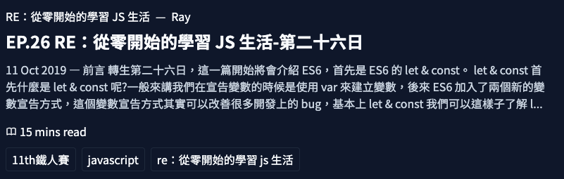

# 搜尋結果設計 - 實用至上主義前端 |【搜尋引擎製作錄】

## 向 Google 取經

要能設計出實用性至上的搜尋結果，  
我們先做一些 Research。

既然要設計搜尋引擎，  
那一定不能錯過，可能是現代人最應該要熟悉的工具 [Google]。

下文就來研究 [Google] 如何設計他的搜尋結果，  
以及我們能進行到什麼程度。


## 搜尋結果的種類

為了盡可能的呈現有用的資訊給用戶，  
[Google] 真的做了非常多的細節功能，    
光是搜尋結果其實細分了很多種類。

### Plain blue link

就是最基本的。

![plain-blue-link]

這是在大部分的搜尋引擎都會實作的常見表現形式，  
基本上都會出現以下幾種元件：

1. Title link - 標題連結  
2. URL - 連結的地址
3. Snippet - 文章節錄

### Enhancement

強化型的結果，可以依據商業型態特化某些元件。

包括讓網址產生 breadcrumbs  
![enhancement-breadcrumb]

站內搜尋  
![enhancement-sitelinks-search]

產生 LOGO  
![enhancement-logo]

以上都可以請 **工程師** 實作 _structured data_ 來達成。

### Rich result

富文本結果可以產生更華麗的結果，並且通常會置頂。

其中可以包含 顯圖  
![rich-result-news]

或是 評價機制  
![rich-result-carousel]

甚至一些更吸引人的功能，像是 `carousel` 輪播。

通常這些富文本結果都是強調某個特定的主題或內容，  
像是 某本書，某部電影，某篇文章 等等。

能帶來更強烈的沈浸式體驗的富文本結果被稱作 _enriched results_，  
其特色就是更進階的互動效果。

### Knowledge panel entry

知識面板整合了一頁或是多頁的資訊，像是展現出豐富的結果像是 圖文 或是 連結。  
跟上述的富文本結果有點難以區分，但主要差異在這個用途是整合性知識。

知識面板可以包含識別符號 (商標，完整網站名稱)。

![knowledge]

### Featured snippet

當用戶搜尋時，部分問題可能會顯示該網站的關鍵字擷取的結果。 

![feature]

### OneBox result

OneBox 結果會顯示直接答案，或是相關的工具。  
例如：當地時間，或是 翻譯。

![onebox]

## 此次的實作

基於現實時間因素，我們大概只能實作 _Plain blue link_ 跟 _Featured snippet_。  
但因為我們此次目標很明確，所以可以加上一些文章特化功能，  
像是 文章系列，文章作者，閱讀時間 等等，  
說不定可以幫助到用戶更快速找到適合的文章。  



其中要注意的點是 `Series` 文章系列 跟 `Title` 文章標題 的部分，  
為了不破壞版型結構造成 [CLS][cls] 都有進行 `truncate`。


```tsx
  ...
          {/* Series */}
          <a
            href={props.series.href}
            target="_blank"
            rel="noopener noreferrer"
            className="block truncate"
          >
            {props.series.name}
          </a>
  ...

        {/* Title */}
        <h2
          className={clsx("pb-1 font-bold", "text-xl md:text-2xl", "truncate")}
        >
          <a href={props.href} target="_blank" rel="noopener noreferrer">
            {props.title}
          </a>
        </h2>
```

_Featured snippet_ 目前是限制 `3` 筆，  
超過數量會顯示 `+N` 按鈕用來展開更多，  
如果有更好的實作建議，也歡迎來 repository 這邊開 discussion。

```tsx
          {/* Featured snippet */}
          <ul className="flex flex-wrap gap-2">
            {hashtags.map((hashtag) => (
              <li key={hashtag} className="mt-2">
                <span className="solid-sm rounded border">{hashtag}</span>
              </li>
            ))}

            {tooMuchHashTags > 0 && (
              <li className="mt-2">
                <span className="solid-sm rounded border">
                  {" "}
                  + {tooMuchHashTags}
                </span>
              </li>
            )}
          </ul>
```


[Google]: https://www.google.com/
[cls]: https://web.dev/cls/

[plain-blue-link]: https://lh3.googleusercontent.com/f7QwCxV68PwaawDzXPeYQcVAcUNM3HeIH5UBQ7eA3z3xatbstDImbhBvh0N1KMAD8GYI=w669

[enhancement-breadcrumb]: https://lh3.googleusercontent.com/_-fpyQHZtYose8tepRSnpfvpEGUy83xf52JN3c0nOgg2Sd6Qz_3tpEbjSTY3gcuUebE=w600

[enhancement-sitelinks-search]: https://lh3.googleusercontent.com/ysgRiNid2v6cjlMFqVmhxBksnLi82UFBMFjQaJDr6bSC8OQw9vHzqGSlRAMWdWk3_FI=w632

[enhancement-logo]: https://lh3.googleusercontent.com/XHpFSrrheebwjz6wz398m6vMZcNu-hOMkTw4Sxu6AiDZVAC9OH-C4yjIEB9VxLz6Bzo=w370

[rich-result-news]: https://lh3.googleusercontent.com/eg3fMTYdsSNv-V42ec_-fhYx_Brqji147SOl3biKQ-xePCgPIhLmGBUp1mnIvjlFCh8b=w341

[rich-result-carousel]: https://lh3.googleusercontent.com/-z5XLJmBTdRSL6LYx7jGGf2hDVL2Xxtx89GDgnY3NP4ewdDttw2hgT92Kgmpkk7wls4=w447

[knowledge]: https://lh3.googleusercontent.com/iSYfJ78_Fbx-UUatU6RVnYLuncTBIzwFjtfKWNT39G7G74yhS9fOPY1seuzyF0FqG50=w453

[feature]: https://lh3.googleusercontent.com/pS8uaGjTZt9ZtPNQ1gf5YveJfeh5b2Sut7sOYzP8EVx3IzjvPKoONEcz3Y1tQXetFm0=w560

[onebox]: https://lh3.googleusercontent.com/_Fj7Ri-KnO7dp0ZquV69MUjIn-hAM22gCCFelRu0C6-d82IYKstklsSfEJ8x5puhizAs=w413

